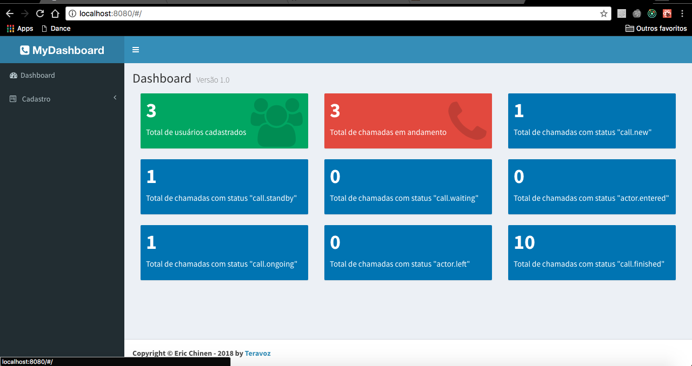

# frontend container

This project was created to deploy the application (dashboard).

## 1 Table of contents
- [1 Table of contents](#1-table-of-contents)
- [2 Installation](#2-installation)
- [3 Folder structure](#3-folder-structure)
- [4 Example pages](#4-example-pages)
    - [4.1 Dashboard main](#41-dashboard-main)
- [5 Library/Framework](#5-libraryframework)

## 2 Installation

From the terminal go to the project folder -> frontend.

```bash
cd webhook-pbx-project/frontend/
```

To generate the build and create an image of the container execute the command below:
```bash
docker build -f frontend.Dockerfile -t  echinen/frontend:v1 .
```

To set up the image generated in a container execute the following command:

```bash
docker run -d --network dev-network -p 8080:3002 echinen/frontend:v1
```

Done! The container **frontend** is running in following url -> http://localhost:8080

## 3 Folder structure
```sh
.
└── ./public                 # index.html
.
└── ./src
    ├── common               # components
    │   ├── layout           # layout template
    │   ├── msg              # msg template
    │   ├── tab              # tab template
    │   ├── template         # template
    │   ├── widget           # widget template
    ├── pages                # react pages
    │   ├── call             # call module
    │   ├── configuration    # configuration module
    │   ├── dashboard        # dashboard module
    │   ├── main             # main root 
    │   ├── payment          # payment root 
    │   ├── user             # user root 
```

## 4 Example pages

Here are some examples of the dashboard pages as below:

### 4.1 Dashboard main

This is the main dasboard page that shows some metrics such as: number of registered users, number of active calls, number of calls with each type of event: call.new, call.standby, call.waiting, actor-entered, call-ongoing, actor-left and call.finished. As the screen below shows:



## 5 Library/Framework

* admin-lte,
* axios,
* babel-core:,
* babel-loader,
* babel-plugin-react-html-attrs,
* babel-plugin-transform-object-rest-spread,
* babel-preset-es2015,
* babel-preset-react,
* css-loader,
* extract-text-webpack-plugin,
* file-loader,
* font-awesome,
* ionicons,
* lodash,
* react,
* react-dom,
* react-redux,
* react-redux-toastr,
* react-router,
* redux,
* redux-form,
* redux-multi,
* redux-promise,
* redux-thunk,
* style-loader,
* webpack,
* webpack-dev-server
