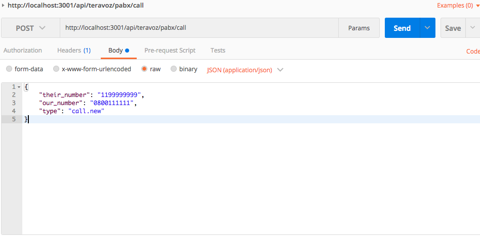
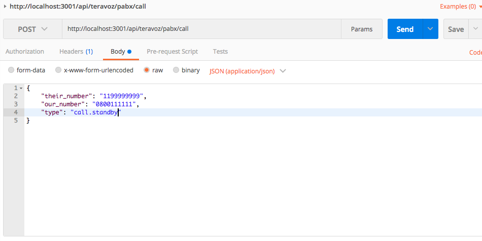
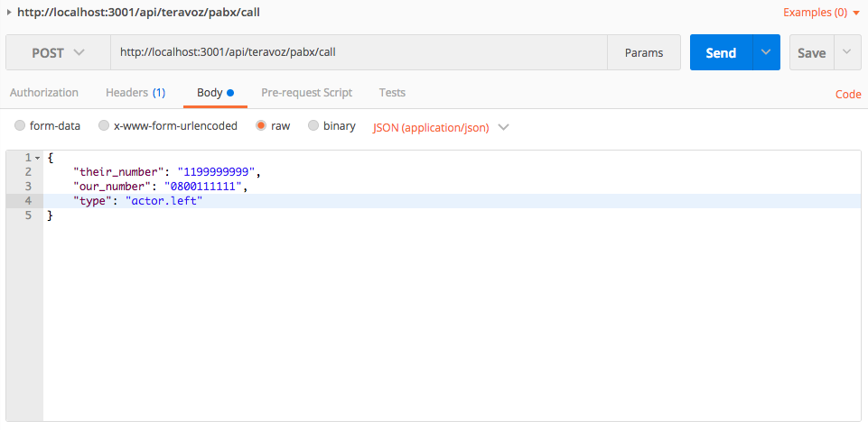
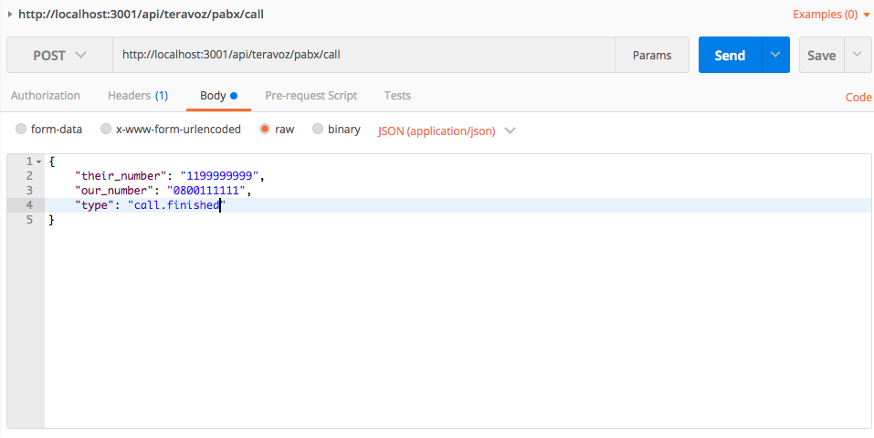

# mock-pbx container

This project was created to simulate PBX API. In addition, it will simulate incoming calls from the PBX **manually**. The idea is that we can make the entire PBX call life cycle and send these events through the client's webhook.

## 1 Table of contents
- [1 Table of contents](#1-table-of-contents)
- [2 Installation](#2-installation)
- [3 Folder structure](#3-folder-structure)
- [4 Example for simulated pabx calls](#4-example-for-simulated-pabx-calls)
    - [4.1 First event call new](#41-first-event-call-new)
    - [4.2 Second event call standby](#42-second-event-call-standby)
    - [4.3 Third event call waiting](#43-third-event-call-waiting)
    - [4.4 Fourth event actor entered](#44-fourth-event-actor-entered)
    - [4.5 Fifth event call ongoing](#45-fifth-event-call-ongoing)
    - [4.6 Sixth event actor left](#46-sixth-event-actor-left)
    - [4.7 Seventh event call finished](#47-seventh-event-call-finished)
- [5 Deploy in development environment and track logs](#5-deploy-in-development-environment-and-track-logs)
- [6 Library/Framework](#6-libraryframework)

## 2 Installation

The installation was previously done through the docker-compose which make it easier to deploy the application.

The container **mock-pbx** is will run in background in the following url -> http://localhost:3001

## 3 Folder structure
```sh
.  
├── config                # config to set up
├── controllers           # controllers module
├── helper                # helper components
├── models                # models module
├── repositories          # repositories module
├── services              # services module
```

## 4 Example for simulated pbx calls

First, the system has a rule that obeys an order for the life cycle of a call (PBX). From there the events are sent to the customer's Webhook in the following order: call.new, call.standby, call.waiting, actor.entered, call.ongoing, actor.left and call.finished.

### 4.1 First-event-call-new
call-new -> When a call is started. This is the first event issued by the PBX and then the client's Webhook.



### 4.2 Second-event-call-standby
call-standby -> When a call is waiting for an action to be taken by delegate.



### 4.3 Third-event-call-waiting
call.waiting -> When a call after starting is waiting to be answered.

In this step we will wait for the action of the client (backend) to send a request to the API (POST) -> http://localhost:3001/api/client/actions (mock-pbx) which makes the delegate to a 900 or 901 attendance queue. At that time it changes the type of the call event -> before: **call.standby** after: **call.waiting**.

### 4.4 Fourth-event-actor-entered
actor-entered -> When the attendant answers a call.


### 4.5 Fifth-event-call-ongoing
call-ongoing -> When a call after started has been answered.


### 4.6 Sixth-event-actor-left
actor-left -> When the attendant hangs up/transfers the call.



### 4.7 Seventh-event-call-finished
call-finished -> When a call has ended.



## 5 Development environment and track logs

To deploy the local server and run it in the development environment. Run the following command.

```bash
$ npm install
```


```bash
$ npm run dev
```


## 6 Library/Framework

* express
* body-parser
* consign
* express-validator
* pm2
* nodemon
* mongoose
* restify
* restify-clients
* uuid

